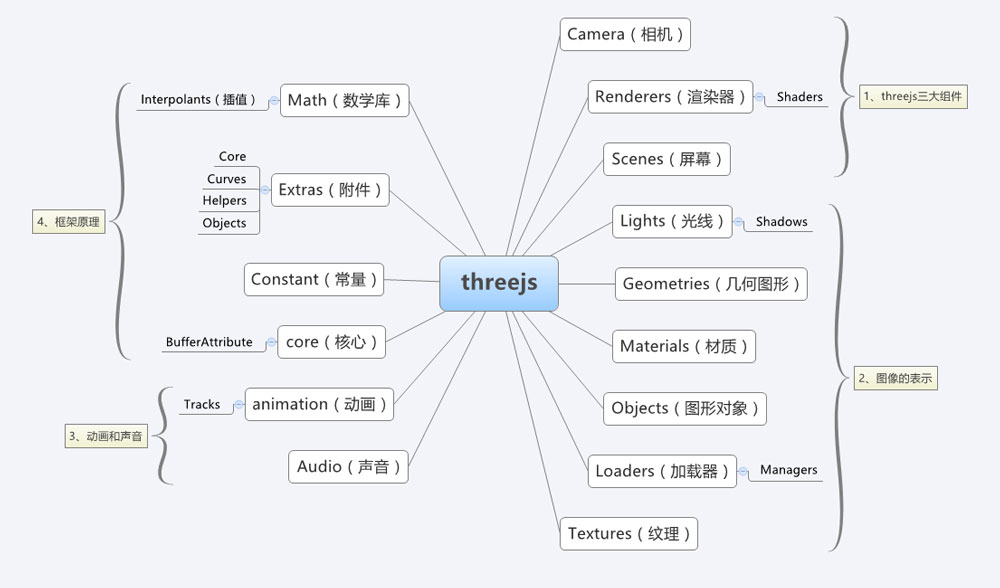
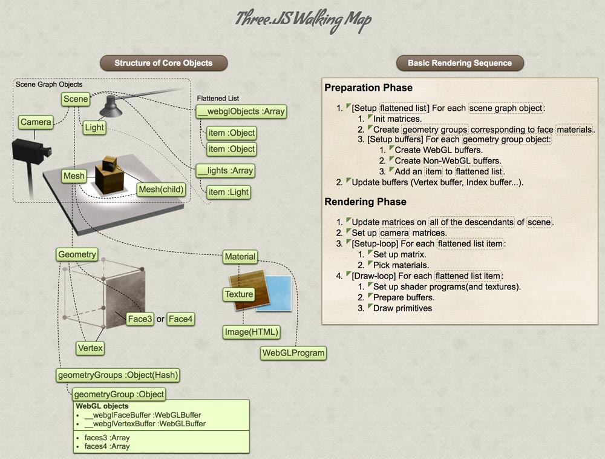
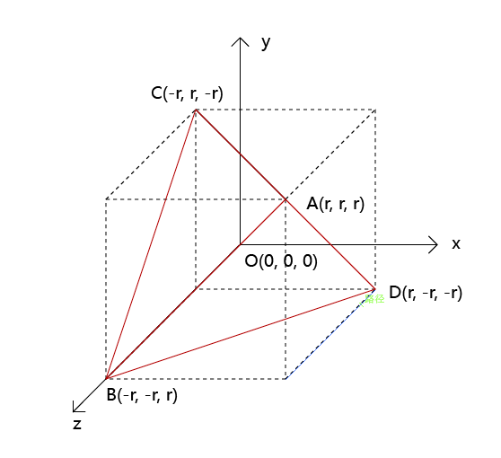
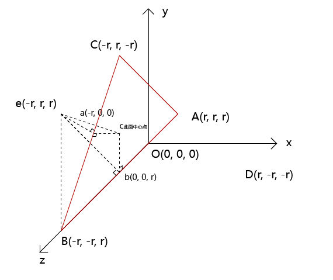
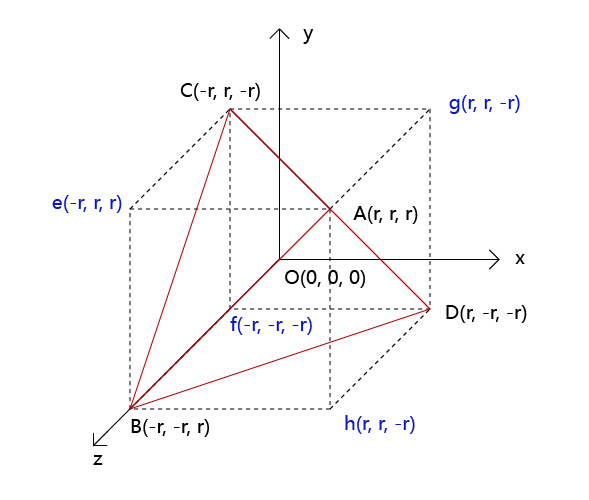
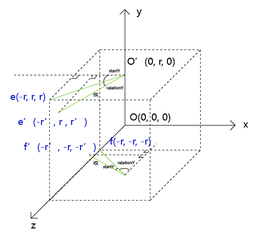
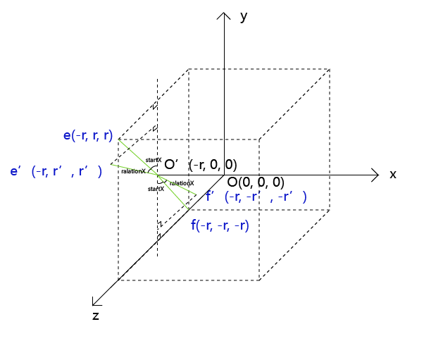

# 3D世界-Three.js的探究与实践

## 项目需求

在开发[育空网站](http://yukon.projects.dragontrail.cn/)时我们需要在页面内使用四面体，还要增加一些交互和操作，因此使用了3D类库Three.js也经历多种波折才实现了我们最终的效果。

> 需要的实现的交互：
> 1.四面体自动旋转；
> 2.旋转过程中监听当前用户正对那个面
> 3.四面体点击某个面时跳转到这个面对应的链接
> 4.实现粒子背景

## 3D世界的初认识

[Three.js官方文档](https://threejs.org/docs/index.html)使用起来对于初学者来说并不优化，通过下面连个Three.js的先关资料对它的理解能更块些


Three.js 文档结构：[图片来自](https://teakki.com/p/58a3ef1bf0d40775548c908f)


Three.js 核心对象结构和基本的渲染流程：[图片来自](http://ushiroad.com/3j/)

**右手坐标系**
Three.js 采用的是的右手坐标系，坐标系的原点在画布中心（canvas.width / 2, canvas.height / 2）。我们可以通过 Three.js 提供的 THREE.AxisHelper() 辅助方法将坐标系可视化。RGB颜色分别代表 XYZ 轴，如下图


右手坐标系：[图片来自](http://ushiroad.com/3j/)

## 创建一个场景

**准备html,引入Three.js**

``` html

<!DOCTYPE html>
<html>
<head>
    <meta charset=utf-8>
    <title>My first three.js app</title>
    <style>
        body { margin: 0; }
        canvas { width: 100%; height: 100% }
    </style>
</head>
<body>
    <script src="https://cdn.bootcss.com/three.js/r83/three.js"></script>
</body>
</html>
```

**创建场景**

``` js
var scene = new THREE.Scene();
var camera = new THREE.PerspectiveCamera( 75, window.innerWidth / window.innerHeight, 0.1, 1000 );

var renderer = new THREE.WebGLRenderer();
renderer.setSize( window.innerWidth, window.innerHeight );
document.body.appendChild( renderer.domElement );
```

上面的代码构建了scene, camera 和 renderer。Three.js的架构支持多种camera，这里使用最常见的远景相机（PerspectiveCamera），也就是类似于人眼观察的方式。第一个属性75设置的是视角（field of view）。
第二个属性设置的是相机拍摄面的长宽比（aspect ratio）。我们几乎总是会使用元素的宽除以高，否则会出现挤压变形。
接下来的2个属性是近裁剪面（near clipping plane） 和 远裁剪面（far clipping plane）。下面这张图可以帮助你理解：


**创建立方体**

```js
var geometry = new THREE.BoxGeometry( 1, 1, 1 );
var material = new THREE.MeshBasicMaterial( { color: 0x2185D0 } );
var cube = new THREE.Mesh( geometry, material );
scene.add( cube );
```

**渲染场景**

*在大多数屏幕上，刷新率一般是60次/秒*

``` js
function animate() {
    requestAnimationFrame( animate );
    renderer.render( scene, camera );
}
animate();
```

**使立方体动起来**

将下列代码添加到animate()函数中renderer.render调用的上方：

``` js
cube.rotation.x += 0.01;
cube.rotation.y += 0.01;
```

最终实现效果如下：
<iframe src="https://codepen.io/piexl-the-selector/embed/maaQrK" width="100%" height="300px" frameborder="0" scrolling="no"> </iframe>

## 3D世界的深层了解

## 四面的实现尝试一(引入模型法)

效果见页面[引入模型法](https://piexl.github.io/explore-threejs/demos/plan1.html)

优点：实现方式简单，贴图完整
缺点：
1.无法设置模型的中心，导致旋转中心偏差模型异常
2.材质贴图后期修改麻烦，无法分开修改
3.点击事件无法增加

**准备素材**

+ 四面体模型
+ 材质贴图
+ obj模型导入库[OBJLoader.js](https://threejs.org/docs/index.html#examples/loaders/OBJLoader)

### 实现方法

#### 构建创景及场景参数设置

```js
//场景设置
var scene = new THREE.Scene();
var camera = new THREE.PerspectiveCamera( 75, window.innerWidth / window.innerHeight, 0.1, 50 );
camera.position.z = 20;
var renderer = new THREE.WebGLRenderer({
    antialias: true,
    alpha: true //canvas是否包含alpha
});
renderer.setPixelRatio( window.devicePixelRatio );
renderer.setSize( window.innerWidth, window.innerHeight );
document.body.appendChild( renderer.domElement );
```

其中`WebGLRenderer`的`alpha`参数为场景的背景透明度，为true则透明能可看到场后后面的背景。

### 场中辅助线、控制器及环境光的设置

```js
//坐标辅助线
var axesHelper = new THREE.AxesHelper( 100 );
scene.add( axesHelper );

//控制器
var controls = new THREE.OrbitControls(camera, renderer.domElement);
controls.enableZoom = false;

//创建一个环境光，并增加到场景中
var ambientLight = new THREE.AmbientLight(0xffffff);
scene.add(ambientLight);
```

### 加载模型

```js
//加载模型
var mesh;
var manager = new THREE.LoadingManager(); //加载管理器
//导入模型纹理Texture
var texture = new THREE.Texture();
var loader = new THREE.ImageLoader(manager);
loader.load('../imgs/obj/texture.jpg', function (image) {
    texture.image = image;
    texture.needsUpdate = true;
});
// 创建loader变量，用于导入模型
var loader = new THREE.OBJLoader(manager);
//第一个表示模型路径，第二个表示完成导入后的回调函数，一般我们需要在这个回调函数中将导入的模型添加到场景中
loader.load('../imgs/obj/tetrahedron.obj', function (obj) {
    obj.traverse(function (child) {
        if (child instanceof THREE.Mesh) {
            child.material.side = THREE.DoubleSide;
            child.material.map = texture;
        }
    });
    mesh = obj;//储存到全局变量中
    mesh.position.y = 0;
    scene.add(mesh);//将导入的模型添加到场景中
    animate();
});
```

`ImageLoader`为图片加载器，`OBJLoader`为obj对象模型加载器，并在模型加载回调中执行渲染函数

### 渲染模型

```js
function animate(){
    requestAnimationFrame(animate);
    if (mesh.rotation.y < Math.PI * 2) {
        mesh.rotation.y += 0.01;
        mesh.rotation.x += 0.01;
    }
    renderer.render(scene, camera);
}
```

渲染时更改模型的角度，让模型转起来

***[注]** 加载模型的方法很多，具体根据你制作模型的软件和导出的模型的格式而定，obj形式只是其中一中而已*

## 四面的实现尝试二（几何四面体实现）

效果见页面[几何四面体实现](https://piexl.github.io/explore-threejs/demos/plan2.html)

优点：实现简单，大小，材质等参数更改方便
缺点：贴图无规则，无法贴图

**实现步骤**

### 构件场景并设置基本参数

```js
//构建场景
var scene = new THREE.Scene();
var camera = new THREE.PerspectiveCamera( 75, window.innerWidth / window.innerHeight, 0.1, 50 );
camera.position.z = 30;
var renderer = new THREE.WebGLRenderer({
    alpha: true
});
renderer.setPixelRatio( window.devicePixelRatio );
renderer.setSize( window.innerWidth, window.innerHeight );
document.body.appendChild( renderer.domElement );
```

### 坐标线、控制器及环境光的增加

```js
// 坐标线
var axesHelper = new THREE.AxesHelper( 100 );
scene.add( axesHelper );

//控制器
var orbit = new THREE.OrbitControls( camera, renderer.domElement );
orbit.enableZoom = false;

//设置环境光
var ambientLight = new THREE.AmbientLight(0xffffff);
scene.add(ambientLight);
```

### 创建四面体模型，并设置材质

```js
// 创建模型
var mesh = new THREE.Object3D()
//设置线段样式
mesh.add( new THREE.LineSegments(
    new THREE.Geometry(),
    new THREE.LineBasicMaterial( {
        color: 0xffffff,
        transparent: true,
        opacity: 0.5
    } )
) );

//设置模型的材质
mesh.add( new THREE.Mesh(
    new THREE.Geometry(),
    new THREE.MeshPhongMaterial( {
        map: new THREE.TextureLoader().load('../imgs/texture.jpg?'+new Date().getTime()),
    } )
));
//四面几何体的类,第一个参数为四面体的半径，第二个参数增加的单数，如果不为这不是四面体
var geometry = new THREE.TetrahedronGeometry(14, 0);
mesh.children[ 0 ].geometry.dispose();
mesh.children[ 1 ].geometry.dispose();
mesh.children[ 0 ].geometry = new THREE.WireframeGeometry( geometry );
mesh.children[ 1 ].geometry = geometry;
scene.add( mesh );
```

### 增加渲染器和辅助线

```js
//包围盒的辅助对象
var box = new THREE.BoxHelper( mesh, 0xffff00 );
scene.add( box );

//渲染器
var render = function () {
    requestAnimationFrame( render );
    var time = Date.now() * 0.001;
    if(mesh.rotation.y <= Math.PI*2){
        mesh.rotation.x += 0.005;
        mesh.rotation.y += 0.005;
    }
    renderer.render( scene, camera );
};
render();
```

增加模型的辅助线更有利于我们对模型的理解

## 四面的实现尝试三（顶点构造法）

效果见页面[顶点构造法](https://piexl.github.io/explore-threejs/demos/plan3.html)

优点：材质贴图可分开，中心点稳定不会偏移
缺点：构造复杂,运算效率低

**实现步骤**

### 构建场景

```js
//构建场景
var scene = new THREE.Scene();
var camera = new THREE.PerspectiveCamera( 75, window.innerWidth / window.innerHeight, 0.1, 1000 );
camera.position.z = 30;
var renderer = new THREE.WebGLRenderer({
    antialias: true,
    alpha: true
});
renderer.setPixelRatio( window.devicePixelRatio );
renderer.setSize( window.innerWidth, window.innerHeight );
document.body.appendChild( renderer.domElement );
```

### 增加控制器、环境光及坐标辅助线，事件处理插件的初始化

```js
//控制器
var orbit = new THREE.OrbitControls( camera, renderer.domElement );
orbit.enableZoom = false;

//环境光
var ambientLight = new THREE.AmbientLight(0xffffff);
scene.add(ambientLight);

//坐标辅助线
var axesHelper = new THREE.AxesHelper( 100 );
scene.add( axesHelper );

//事件处理初始化
var interaction = new THREE.Interaction(renderer, scene, camera);
```

### 创建四面体的每个顶点及构造四个面

利用下面的这张图有助于我们理解这个四面体的构建，设定一个基本单位r，四面的四个点顶点位置如下图：



```js
//定义几何点
var cubeGeometry = new THREE.Geometry();
//创建四面的顶点
var r = 8;
var vertices = [
    new THREE.Vector3(r, r, r), //v0
    new THREE.Vector3(-r, -r, r), //v1
    new THREE.Vector3(-r, r, -r), //v2
    new THREE.Vector3(r, -r, -r), //v3
];
//设置四面体的各个坐标点
cubeGeometry.vertices = vertices;
//创建立方的面，各个面的排列顺序
var faces=[
    new THREE.Face3(0,1,2),
    new THREE.Face3(1,3,2),
    new THREE.Face3(2,3,0),
    new THREE.Face3(3,1,0),
];
cubeGeometry.faces = faces;
```

### 为四面体每个面设置贴图

```js
//给四面体设置贴图
var materials = [];  //创建一个贴图数组
//设置贴图数组
for(var i = 0;i < cubeGeometry.faces.length;i++){
    materials[i] = new THREE.MeshBasicMaterial({
        // map: new THREE.TextureLoader().load('../imgs/texture' + (i+1) + '.jpg?'+new Date().getTime()),
        map: new THREE.TextureLoader().load('../imgs/texture_new-0' + (i+1) + '.jpg?'+new Date().getTime()),
        side: THREE.DoubleSide,
    })
}
//记录每个面的id，将纹理坐标和faceid间接关联，否则纹理图片始终都是第一张的图片
var faceId = 0;
var uv = [
    new THREE.Vector2(0,0), //图片左下角
    new THREE.Vector2(1,0), //图片右下角
    new THREE.Vector2(1,1), //图片右上角
    new THREE.Vector2(0,1), //图片左上角
];
//设置纹理坐标
for(var m=0;m<cubeGeometry.faces.length;m+=1){
    cubeGeometry.faces[m].materialIndex = faceId;
    cubeGeometry.faceVertexUvs[0][m] = [uv[0],uv[1],uv[2]];
    faceId++;
}
```

### 创建四面体并为其增加辅助线

```js
//创建四面体
var cube = new THREE.Mesh(cubeGeometry,materials);

//增加盒辅助线
var box = new THREE.BoxHelper( cube, 0xffff00 );
scene.add( box );
```

### 为四面体增加各面的法线点

要寻找过四面体每个面过中心点的法线，即过此面的中心且垂直于这个面的点构成的线.
以四面体ABC面为例：

C为ABC面的中心，
∵ Bb ⊥ cb 且 eb ⊥ Bb
∴ Bb ⊥ bce
∴ Bb ⊥ ec
同理可证 Ba ⊥ ec
∵ Bb ⊥ ec 且 Ba ⊥ ec
∴ ec ⊥ ABC
所以 ec为面ABC的法线，e为ABC面法线上的点

其他面的法线点如下图中（efgh）：


```js
//四个面的法线点
var pointsGeometry = new THREE.Geometry();
var normalPoints = [
    new THREE.Vector3(-r, r, r),
    new THREE.Vector3(-r, -r, -r),
    new THREE.Vector3(r, r, -r),
    new THREE.Vector3(r, -r, r)
];
pointsGeometry.vertices = normalPoints;
var pointsMaterial = new THREE.PointsMaterial( {
    color: 0xfffffff,
    size:0.5,
} );
var pointsField = new THREE.Points( pointsGeometry, pointsMaterial );
```

### 把四面体和法线点放到同一个组中

```js
var group = new THREE.Group();
group.add( cube );
group.add( pointsField );
group.autoRate = true;
scene.add( group );
```

### 监听当前正对到那个面

四面体转动过程中法线点的新坐标获取：

当四面体绕绕Y轴转动转动（Y坐标不发生变化）:
Y轴准东的角度:`ralationY = group.rotation.y`
开始时在水平面的角度:`startY = Math.abs(Math.atan(x/z))`
那么Y轴总角度为:`degY = startY + ralationY`
水平面转动的半径为:`fR = Math.sqrt(Math.pow(x, 2) + Math.pow(z, 2))`
转动后打的点x坐标为: `x = fR * (z / x > 0 ? Math.sin(degY) : Math.cos(degY)) * (x > 0 ? 1 : -1)`
 
以法线点e(-r, r, r)和f(-r, -r, -r)为例参考下图：


当四面体绕绕X轴转动转动（X坐标不发生变化）:
X轴准东的角度:`ralationX = group.rotation.x`
开始时在竖直面的角度:`startX = Math.abs(Math.atan(y/z)),`
那么X轴总角度为:`degX = startX + ralationX`
竖直面转动的半径为:`sR = Math.sqrt(Math.pow(y, 2) + Math.pow(z, 2))`
转动后打的点y坐标为: `y = sR * (z / y > 0 ? Math.cos(degX) : Math.sin(degX)) * (y > 0 ? 1 : -1)`

以法线点e(-r, r, r)和f(-r, -r, -r)为例参考下图：


```js
//法线点的初始位置
var originalPonits = [
    new THREE.Vector3(-r, r, r),
    new THREE.Vector3(-r, -r, -r),
    new THREE.Vector3(r, r, -r),
    new THREE.Vector3(r, -r, r)
];
//监听当前属于哪个面
function checkCurFace(){
    var degCell = 2 * Math.PI / 360;
    var distance = [];//与相机位置的距离
    originalPonits.forEach(function (item, index) {
        var itemOldPoint = normalPoints[index];
        var x = itemOldPoint.x,
            y = itemOldPoint.y,
            z = itemOldPoint.z,
            startX = Math.abs(Math.atan(y/z)),
            startY = Math.abs(Math.atan(x/z)),
            ralationX = group.rotation.x,
            ralationY = group.rotation.y,
            degX = startX + ralationX,
            degY = startY + ralationY,
            fR = Math.sqrt(Math.pow(x, 2) + Math.pow(z, 2)),//底部投影半径
            sR = Math.sqrt(Math.pow(y, 2) + Math.pow(z, 2)),//侧面投影半径
            cR = Math.sqrt(Math.pow(x, 2) + Math.pow(y, 2) + Math.pow(z, 2)); //向量点距中心的半径

        item.x = fR * (z / x > 0 ? Math.sin(degY) : Math.cos(degY)) * (x > 0 ? 1 : -1);
        item.z = sR * (z / y > 0 ? Math.sin(degX) : Math.cos(degX)) * (z > 0 ? 1 : -1);
        item.y = sR * (z / y > 0 ? Math.cos(degX) : Math.sin(degX)) * (y > 0 ? 1 : -1);

        var distanceX = camera.position.x - item.x,
            distanceY = camera.position.y - item.y,
            distanceZ = camera.position.z - item.z;
        distance.push(Math.sqrt(Math.pow(distanceX, 2) + Math.pow(distanceY, 2) + Math.pow(distanceZ, 2)));
    });
    var minDistance = Math.min.apply(null, distance),
        curIndex = distance.indexOf(minDistance);
    console.log('curIndex', '当前面的序号为:'+curIndex);
}
```

这个检查函数中使用了立体结合的一些知识，最终根据转动时每个法线点坐标更新，获得它与相机两点点的距离，距离最短的就是当前的这是激活面。


### 给四面体增加事件

```js
//给四面体增加事件
cube.on('click', function (ev) {
    //点击检查当前的激活面
    checkCurFace();
});
cube.on('mouseover', function (ev) {
    //鼠标进入四面体组停止转动
    group.autoRate = false;
});
cube.on('mouseout', function (ev) {
    //鼠标离开四面体组开始转动
    group.autoRate = true;
});
```

### 增加渲染器让四面体旋转起来

```js
//渲染器
var render = function () {
    requestAnimationFrame( render );
    var time = Date.now() * 0.001;
    if(group.autoRate){
        if(group.rotation.x < Math.PI*2){
            group.rotation.x += 0.01;
            group.rotation.y += 0.01;
        }else{
            group.rotation.x = 0;
            group.rotation.y = 0;
        }
    }
    checkCurFace();
    renderer.render( scene, camera );
};
render();
```

在每次更新是检查当前属于那个面

## 粒子背景的实现

效果见页面[粒子背景](https://piexl.github.io/explore-threejs/demos/particle-bg.html)

**实现方法**

### 构建场景

```js
//创建场景
var scene = new THREE.Scene();
var camera = new THREE.PerspectiveCamera(75, window.innerWidth / window.innerHeight, 1, 2000);
camera.position.z = 1000;
var renderer = new THREE.WebGLRenderer({
    alpha: true
});
renderer.setPixelRatio(window.devicePixelRatio);
renderer.setSize(window.innerWidth, window.innerHeight);
document.body.appendChild( renderer.domElement );
```

### 增加光源

```js
//光源添加到场景中
var ambientLight = new THREE.AmbientLight(0xffffff);
scene.add(ambientLight);
```

### 创建星空点

```js
//创建星空点
var starsGeometry = new THREE.Geometry();
for ( var i = 0; i < 1000; i ++ ) {
    var star = new THREE.Vector3();
    star.x = Math.random() * 2000 - 1000;
    star.y = Math.random() * 2000 - 1000;
    star.z = Math.random() * 2000 - 1000;
    starsGeometry.vertices.push( star );
}
var textureLoader = new THREE.TextureLoader();
var sprite = textureLoader.load('../imgs/snowflake1.png');
var PointSizes = [2,3,4,5,6,7,8,9];
var starsMaterial = new THREE.PointsMaterial( {
    color: 0xfffffff,
    size: PointSizes[parseInt(Math.random()*7)],
    map: sprite,
} );
var starField = new THREE.Points( starsGeometry, starsMaterial );
scene.add( starField );
```

粒子类Points( geometry, material )

+ geometry — （可选）是一个[Geometry](https://threejs.org/docs/index.html#api/zh/core/Geometry)或者[BufferGeometry](https://threejs.org/docs/index.html#api/zh/core/BufferGeometry)的实例，默认值是一个新的[BufferGeometry](https://threejs.org/docs/index.html#api/zh/core/BufferGeometry)
+ material — （可选） 是一个对象，默认值是一个具有随机颜色的新的 [PointsMaterial](https://threejs.org/docs/index.html#api/zh/materials/PointsMaterial)

### 渲染场景

```js
// 渲染器
function render() {
    var time = Date.now() * 0.00005;
    camera.position.x += camera.position.x * 0.05;
    camera.position.y += camera.position.y * 0.05;
    camera.lookAt(scene.position);
    for (var i = 0; i < scene.children.length; i++) {
        var object = scene.children[i];
        if (object instanceof THREE.Points) {
            object.rotation.y = time * (i < 4 ? i + 1 : -(i + 1));
        }
    }
    requestAnimationFrame(render);
    renderer.render(scene, camera);
}
render();
```

每次渲染的时候修改相机的x和y的位置，让星空转起来。修改每个点的y坐标让点有自身的变化。

## 参考链接

+ threejs官方文档: [https://threejs.org/docs/index.html](https://threejs.org/docs/index.html) (现在可切换中文文档了)
+ threejs教程:[https://teakki.com/p/58a3ef1bf0d40775548c908f](https://teakki.com/p/58a3ef1bf0d40775548c908f)
+ Three.js 现学现卖: [https://aotu.io/notes/2017/08/28/getting-started-with-threejs/](https://aotu.io/notes/2017/08/28/getting-started-with-threejs/)
+ threejs+tweenjs实现3D粒子模型切换: [https://juejin.im/post/5b8d47cce51d4538bf55e3a8](https://juejin.im/post/5b8d47cce51d4538bf55e3a8)
+ three.interaction.js(给threejs中模型增加事件的类库)：[https://github.com/jasonChen1982/three.interaction.js](https://github.com/jasonChen1982/three.interaction.js)
